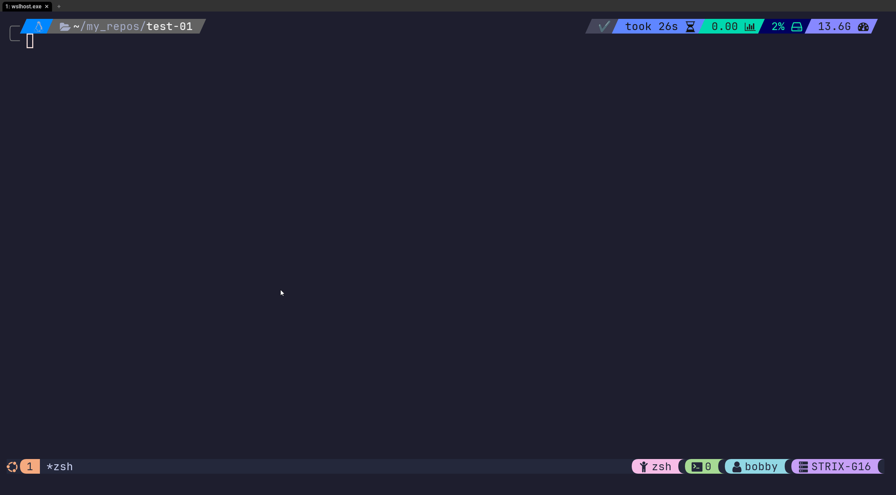

# Tetxtuals-Stopwatch
Demoing textuals with a simple stopwatch app.

<br />



<br />

# Installing and running

Install dependecies and create virtual environment wuth uv.
```bash
uv sync
```

<br />

Activate virtual environment and run program
```bash
uv run main.py
```

<br />

Or do it all with one command
```bash
uv sync && uv run main.py
```

<br />

## Actions
`d` - Toggle between dark/light mode  
`a` - add another stopwatch  
`r` - remove the last stopwatch 
